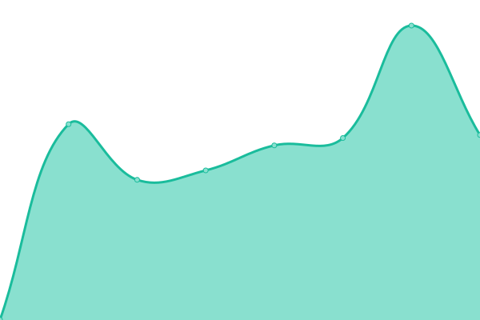

# [📈 Live Status](https://ilger01.github.io/Uptime): <!--live status--> **🟩 All systems operational**

This repository contains the open-source uptime monitor and status page for [ilger01](https://ilger01.github.io/Uptime), powered by [Upptime](https://github.com/upptime/upptime).

With [Upptime](https://upptime.js.org), you can get your own unlimited and free uptime monitor and status page, powered entirely by a GitHub repository. We use [Issues](https://github.com/ilger01/Uptime/issues) as incident reports, [Actions](https://github.com/ilger01/Uptime/actions) as uptime monitors, and [Pages](https://ilger01.github.io/Uptime) for the status page.

<!--start: status pages-->
<!-- This summary is generated by Upptime (https://github.com/upptime/upptime) -->
<!-- Do not edit this manually, your changes will be overwritten -->
<!-- prettier-ignore -->
| URL | Status | History | Response Time | Uptime |
| --- | ------ | ------- | ------------- | ------ |
|  MTA2-DC | 🟩 Up | [mta-2-dc.yml](https://github.com/ilger01/Uptime/commits/HEAD/history/mta-2-dc.yml) | 

 115ms
     
 | 

<a href="https://ilger01.github.io/Uptime/history/mta-2-dc">100.00%</a>
    

|  MTA3-DC | 🟩 Up | [mta-3-dc.yml](https://github.com/ilger01/Uptime/commits/HEAD/history/mta-3-dc.yml) | 

 113ms
     
 | 

<a href="https://ilger01.github.io/Uptime/history/mta-3-dc">100.00%</a>
    

|  MTA4-DC | 🟩 Up | [mta-4-dc.yml](https://github.com/ilger01/Uptime/commits/HEAD/history/mta-4-dc.yml) | 

 113ms
     
 | 

<a href="https://ilger01.github.io/Uptime/history/mta-4-dc">100.00%</a>
    

|  PRX_2_DC | 🟩 Up | [prx-2-dc.yml](https://github.com/ilger01/Uptime/commits/HEAD/history/prx-2-dc.yml) | 

 763ms
     
 | 

<a href="https://ilger01.github.io/Uptime/history/prx-2-dc">100.00%</a>
    

|  PRX_3_DC | 🟩 Up | [prx-3-dc.yml](https://github.com/ilger01/Uptime/commits/HEAD/history/prx-3-dc.yml) | 

 766ms
     
 | 

<a href="https://ilger01.github.io/Uptime/history/prx-3-dc">100.00%</a>
    

|  MX3 | 🟩 Up | [mx-3.yml](https://github.com/ilger01/Uptime/commits/HEAD/history/mx-3.yml) | 

 773ms
     
 | 

<a href="https://ilger01.github.io/Uptime/history/mx-3">99.71%</a>
    

|  MX2 | 🟩 Up | [mx-2.yml](https://github.com/ilger01/Uptime/commits/HEAD/history/mx-2.yml) | 

 632ms
     
 | 

<a href="https://ilger01.github.io/Uptime/history/mx-2">100.00%</a>
    

|  OPEN12 | 🟩 Up | [open-12.yml](https://github.com/ilger01/Uptime/commits/HEAD/history/open-12.yml) | 

 973ms
     
 | 

<a href="https://ilger01.github.io/Uptime/history/open-12">100.00%</a>
    

|  Z_POLARIS | 🟩 Up | [z-polaris.yml](https://github.com/ilger01/Uptime/commits/HEAD/history/z-polaris.yml) | 

 853ms
     
 | 

<a href="https://ilger01.github.io/Uptime/history/z-polaris">100.00%</a>
    

|  POSTA_ZEUS | 🟩 Up | [posta-zeus.yml](https://github.com/ilger01/Uptime/commits/HEAD/history/posta-zeus.yml) | 

 775ms
     
 | 

<a href="https://ilger01.github.io/Uptime/history/posta-zeus">100.00%</a>
    

|  SPIDER4WEB | 🟩 Up | [spider-4-web.yml](https://github.com/ilger01/Uptime/commits/HEAD/history/spider-4-web.yml) | 

 938ms
     
 | 

<a href="https://ilger01.github.io/Uptime/history/spider-4-web">100.00%</a>
    

|  BBMNET | 🟩 Up | [bbmnet.yml](https://github.com/ilger01/Uptime/commits/HEAD/history/bbmnet.yml) | 

 768ms
     
 | 

<a href="https://ilger01.github.io/Uptime/history/bbmnet">100.00%</a>
    

|  Z02_CASACURA | 🟩 Up | [z02-casacura.yml](https://github.com/ilger01/Uptime/commits/HEAD/history/z02-casacura.yml) | 

 793ms
     
 | 

<a href="https://ilger01.github.io/Uptime/history/z02-casacura">99.81%</a>
    

|  MAIL1_BP | 🟩 Up | [mail-1-bp.yml](https://github.com/ilger01/Uptime/commits/HEAD/history/mail-1-bp.yml) | 

 780ms
     
 | 

<a href="https://ilger01.github.io/Uptime/history/mail-1-bp">99.75%</a>
    

|  MAIL_ACIER_PLUS | 🟩 Up | [mail-acier-plus.yml](https://github.com/ilger01/Uptime/commits/HEAD/history/mail-acier-plus.yml) | 

 759ms
     
 | 

<a href="https://ilger01.github.io/Uptime/history/mail-acier-plus">100.00%</a>
    

|  FONDAZIONECRT | 🟩 Up | [fondazionecrt.yml](https://github.com/ilger01/Uptime/commits/HEAD/history/fondazionecrt.yml) | 

 737ms
     
 | 

<a href="https://ilger01.github.io/Uptime/history/fondazionecrt">100.00%</a>
    

|  BARI_02 | 🟩 Up | [bari-02.yml](https://github.com/ilger01/Uptime/commits/HEAD/history/bari-02.yml) | 

 750ms
     
 | 

<a href="https://ilger01.github.io/Uptime/history/bari-02">100.00%</a>
    

|  COMUNE_SANLAZZARO | 🟩 Up | [comune-sanlazzaro.yml](https://github.com/ilger01/Uptime/commits/HEAD/history/comune-sanlazzaro.yml) | 

 786ms
     
 | 

<a href="https://ilger01.github.io/Uptime/history/comune-sanlazzaro">100.00%</a>
    

|  MAIL02_FOMGRP | 🟩 Up | [mail-02-fomgrp.yml](https://github.com/ilger01/Uptime/commits/HEAD/history/mail-02-fomgrp.yml) | 

 778ms
     
 | 

<a href="https://ilger01.github.io/Uptime/history/mail-02-fomgrp">100.00%</a>
    

|  MTA1_MAILISSIMA | 🟩 Up | [mta-1-mailissima.yml](https://github.com/ilger01/Uptime/commits/HEAD/history/mta-1-mailissima.yml) | 

 658ms
     
 | 

<a href="https://ilger01.github.io/Uptime/history/mta-1-mailissima">100.00%</a>
    

|  OPENDOTCOM | 🟩 Up | [opendotcom.yml](https://github.com/ilger01/Uptime/commits/HEAD/history/opendotcom.yml) | 

 772ms
     
 | 

<a href="https://ilger01.github.io/Uptime/history/opendotcom">100.00%</a>
    

|  PIXTEAM | 🟩 Up | [pixteam.yml](https://github.com/ilger01/Uptime/commits/HEAD/history/pixteam.yml) | 

 950ms
     
 | 

<a href="https://ilger01.github.io/Uptime/history/pixteam">100.00%</a>
    

<!--end: status pages-->

[**Visit our status website →**](https://ilger01.github.io/Uptime)

## 📄 License

- Powered by: [Upptime](https://github.com/upptime/upptime)
- Code: [MIT](./LICENSE) © [ilger01](https://ilger01.github.io/Uptime)
- Data in the `./history` directory: [Open Database License](https://opendatacommons.org/licenses/odbl/1-0/)
